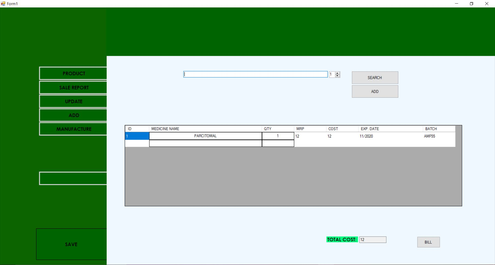
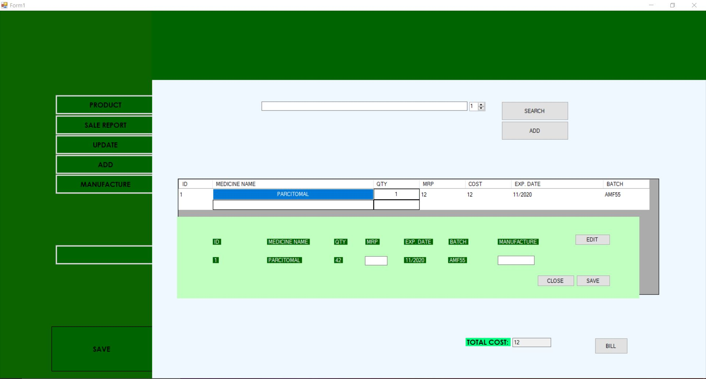
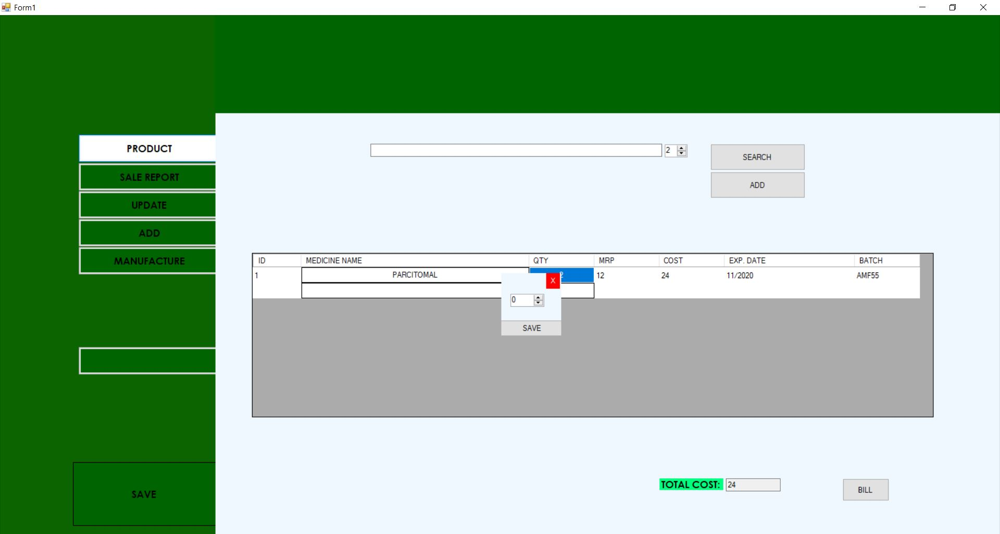
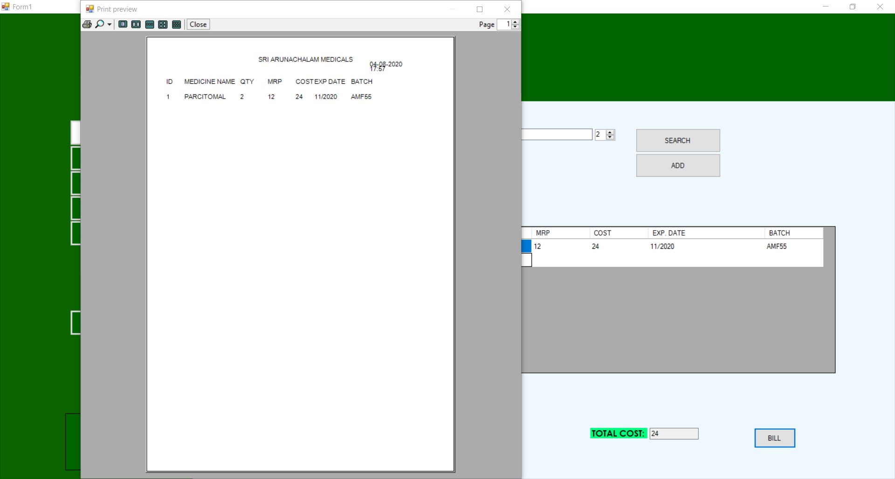
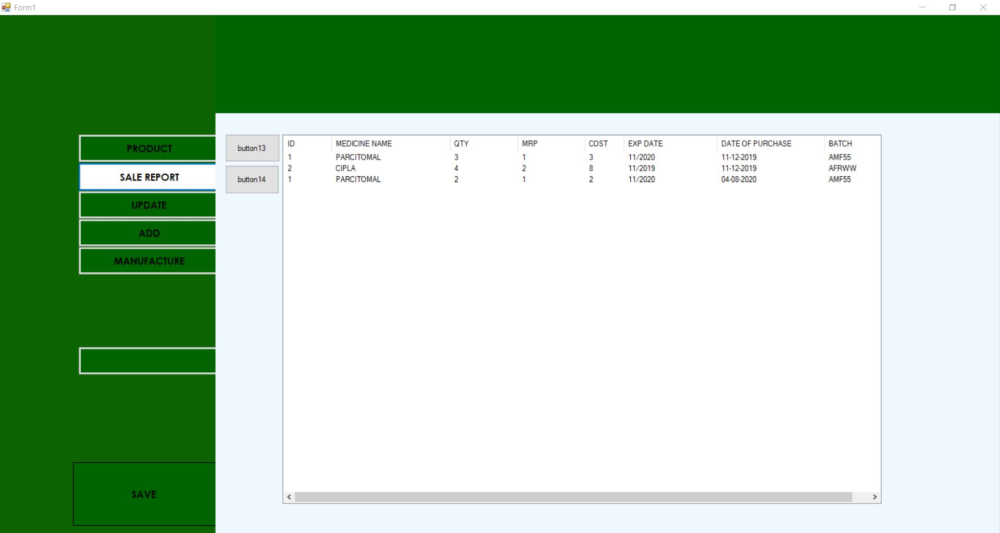
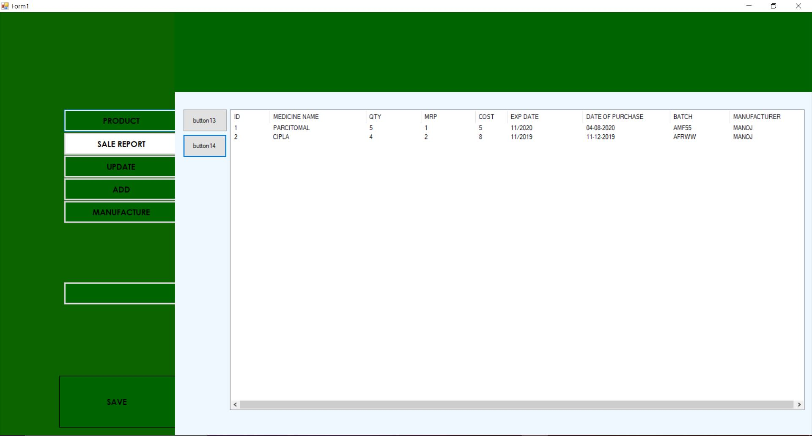
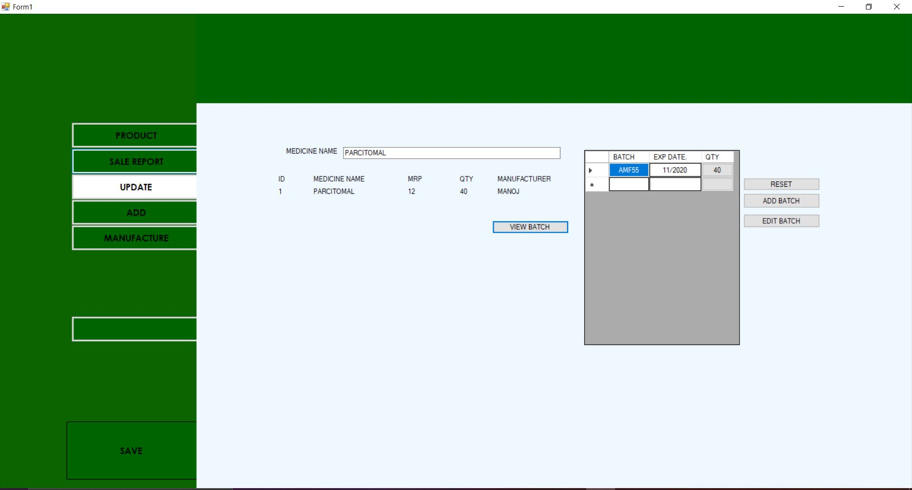
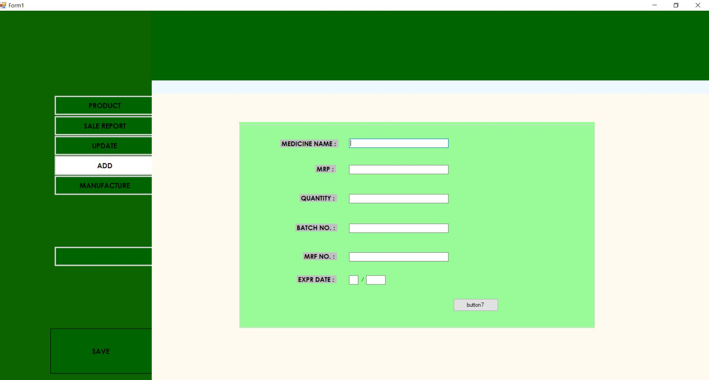
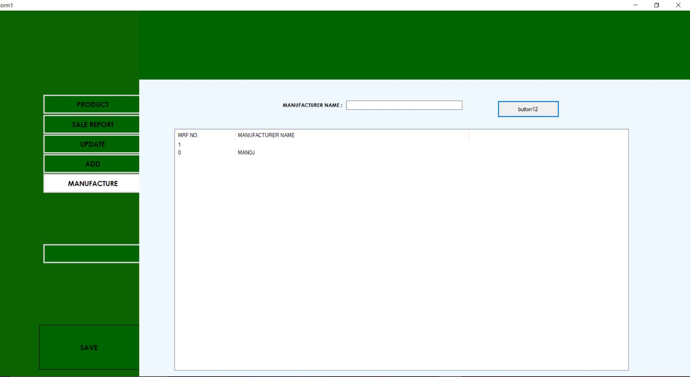

# pharmacy-inventory-and-sales-management
    This is a project i am currently working on with a local busniess for developing a windows application,
    for managing inventory and sale.
   This is my first real world project.
## ABOUT THE PROJECT 

   This is the starting page where the medicine are billed   

   there are multiple feature like checking inventor of 
 of a perticular product   

   this for changing qantity of the product  

this is for printing bill  

  sales report  

  inventory sales report  

  adding inventory  

  addind new medicine  

  adding new manufacture this for giving a number for each one which will be easy for loading medicine  
